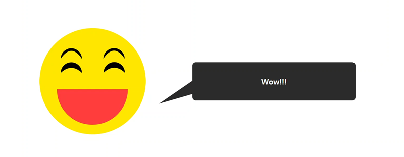

<h1 align="center">
  <br/>kgc
</h1>

## Requirements
### HW
1. Smartphone or laptop

2. Raspberry Pi 3/4 or PC
    - Peripherals needed
        - Video/audio input devices (e.g. webcam)
        - Display/audio output device (e.g. touch display/speaker)
    -  Korean language setting for Raspberry Pi OS
        ```bash
        sudo apt-get install fonts-unfonts-core
        sudo apt-get install ibus ibus-hangul
        sudo reboot
        ```
### SW
- Chromium based browsers
- Node.js
- Python

#### keti server
- FFmpeg install (https://www.gyan.dev/ffmpeg/builds/)
    -  For Windows, add FFmpeg to Windows path using Environment variables

## API settings
### Talk endpoints
- Replace the API endpoints in gnict/public/config.js with your API endpoints

### Kakao OpenAPI for STT/TTS
- Create a .env file at the keti directory and add your {API_KEY} to it (e.g. API_KEY=*************************)
- https://speech-api.kakao.com/
- https://developers.kakao.com/docs/latest/ko/voice/rest-api
- https://docs.kakaoi.ai/skill/ssml_guide/
- https://ai-creator.tistory.com/70


# WebRTC references

- Python WebRTC basics with aiortc, https://dev.to/whitphx/python-webrtc-basics-with-aiortc-48id
<!-- - Building a WebRTC video broadcast using Javascript, https://gabrieltanner.org/blog/webrtc-video-broadcast
- WebRTC tutorial, https://www.youtube.com/watch?v=QJMM758oCYk&list=PLayYqdnyegt0qX8EfEGExxZF3DxkyA1Dj -->
